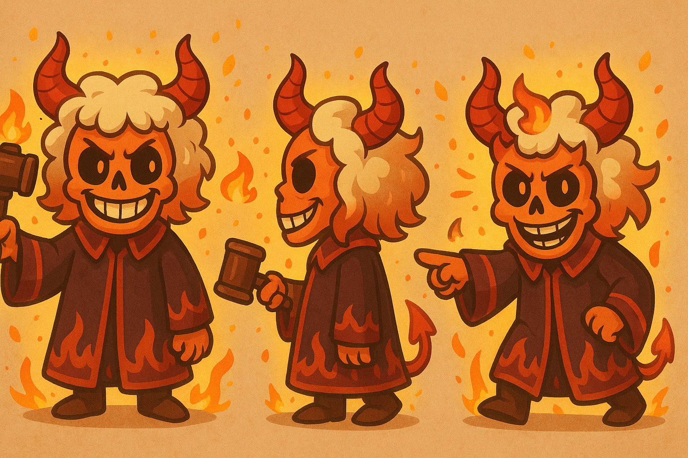
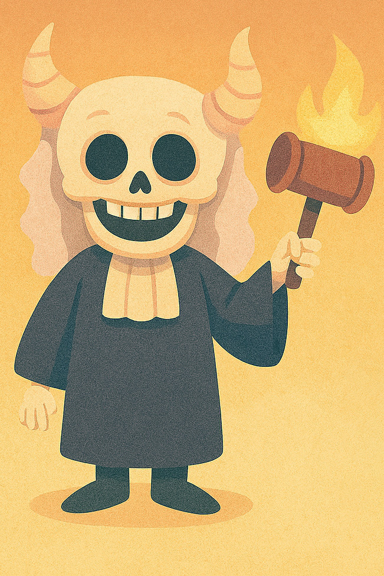

# Juez Esqueletal

**Resumen:**

Es el primer personaje que el jugador ve al iniciar el juego. Le explica sus objetivos a largo plazo, pero de forma ambigua. No se involucra activamente en el resto del juego, pero su presencia marca un tono extraño e intrigante.

**Personalidad:**

- Misterioso
- Vago
- Un poco cínico
- Habla con frases sueltas, como si no entendiera del todo lo que pasa

**Frases importantes:**

- “En este círculo del infierno no hay cangrejos, en los otros sí.”
- “No sé por qué terminaste en este círculo, quizás porque fuiste muy malo o algo.”
- “Yo solo dicto sentencias, lo demás es cosa tuya.”

**Rol en la historia:**

- Introduce el tono general del juego: confuso pero intrigante.
- Da el objetivo principal.
- Marca el inicio y el final del juego, pero no participa en los puzzles intermedios.
- Puede reaparecer en algún momento clave si querés subvertir expectativas.

**Ubicación:**

- Una especie de sala de juicio ceremonial, medio en ruinas, ubicada en la entrada al círculo infernal.
- Fondo oscuro, columnas rotas, un sello brillante en el piso.

**Notas adicionales:**

- Su diseño debe ser visualmente fuerte: toga con llamas, cuernos, martillo gigante decorativo.
- Puede tener un reloj de arena invertido que gira solo.
- Su voz (si tiene) debería ser lenta y hueca.