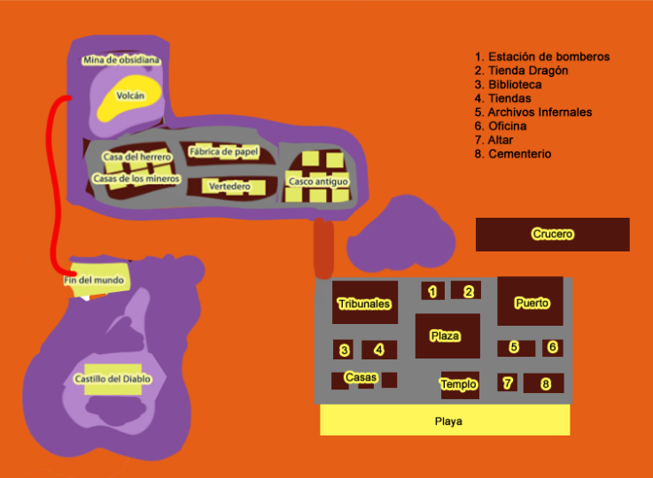

# Platformer45

# **Historia**

Sos un esqueleto llamado [Maki](Maki%20211d96a049b6806f9873edeab39d015c.md). El juego comienza con un "juicio", donde el [juez](Juez%20Esqueletal%20211d96a049b68061b8add2b935658a70.md) simplemente te declara culpable y te indica que debes redimirte ayudando a otros tres esqueletos. Si lo logras, podrías ascender a un círculo infernal "ligeramente mejor": uno con cangrejos.

Por alguna razón, existe un sentimiento anticangrejos en este círculo infernal, aunque nadie da explicaciones claras al respecto cuando se les pregunta.

El primer esqueleto que debes ayudar es [Púbol](P%C3%BAbol%20211d96a049b680798249d7b02f8b838b.md), un ex-artista sumido en la pobreza extrema. Tu misión es ayudarlo a recuperarse resolviendo puzles.

El segundo esqueleto es [Juana](Juana%20211d96a049b6806da6def25622b854de.md), una abogada que busca presentar una demanda colectiva contra el Diablo para ayudar a otros esqueletos a acceder a un mejor círculo infernal. Tu tarea es ayudarla a completar los ridículos trámites burocráticos.

El tercer esqueleto es Franc, un demolicionista que es el único capaz de remover una enorme roca que bloquea el paso al crucero —la única salida de este círculo infernal. Al explorar la ciudad, los elementos más destacados son el Castillo del Diablo y el enorme crucero.

### **Género**

Aventura, Puzzles, Point & Click, Humor absurdo

### **Estética**

Infernal caricaturesco, humor gótico, con influencias de *Animal Crossing* y *juegos de Lucas Arts* como *Grim Fandango.*

# Personajes Principales

Maki hecho por IA, proximamente un modelo real hecho por humanos (?

| **Nombre** | **Descripción** |
| --- | --- |
| [**Maki**](Maki%20211d96a049b6806f9873edeab39d015c.md) | Protagonista, esqueleto recién llegado |
| [**El Juez Esqueletal**](Juez%20Esqueletal%20211d96a049b68061b8add2b935658a70.md) | Figura burocrática y arbitraria que guía tu “redención” |
| [**Púbol**](P%C3%BAbol%20211d96a049b680798249d7b02f8b838b.md) | Artista frustrado que vive en la calle |
| **Juana** | Abogada que intenta demandar al Diablo |
| **Franc** | Demolicionista sindicalizado. |
| **El Diablo** | Literalmente un cangrejo |

[Inicio de Juego](Inicio%20de%20Juego%20211d96a049b680949a6dda00b2cc9c5d.md)

[Personajes](Personajes%20211d96a049b6805987b1ecab0f0ec86b.md)

[Objetos de quests](Objetos%20de%20quests%20210d96a049b6817da0b9c9c605346184.csv)

[Pincel](Pincel%20210d96a049b680f4969aedfcf5e525b4.md)

[Lienzo](Lienzo%20210d96a049b6800bb527e9ed55503328.md)

[Final](Final%20211d96a049b680718f03da15af13306a.md)