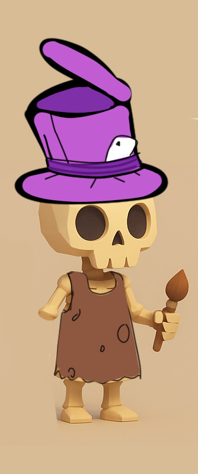

# Púbol

**Resumen**

Un artista bohemio y callejero que vive en un baldío. Es el primer NPC que ofrece múltiples quests al jugador, guiándolo en la creación de sus primeras herramientas artísticas (Lienzo, Pincel, Pinturas). Aunque está en situación de calle, mantiene una visión romántica del arte y la vida. Tiene un sombrero roto y le falta un brazo.

**Personalidad**

Soñador, ingenuo, directo.

Tiene convicciones fuertes, especialmente sobre el arte ético, pero a veces roza lo ridículo en sus prioridades.

**Frases importantes**

- *"Ayudame, estoy en la lona bro."*
- *"No quiero ningún pincel de marta Kolinsky o que haya tenido que ver con el sufrimiento animal."*
- *"¿Sabés lo que haría con un poco de azul cobalto?... llorar, probablemente."*
- *"El arte no se compra, se encuentra. Bah, igual si tenés democoins también messirve."*

**Rol en la historia**

- Es un NPC clave en el inicio del juego.
- Ofrece tres quests consecutivas:
    1. Conseguir un lienzo (reciclado de elementos callejeros).
    2. Armar un pincel (con elementos naturales).
    3. Obtener pinturas (de fuentes no convencionales).
- Introduce al jugador al sistema de crafting y recolección.
- Sirve como contrapunto humorístico y filosófico.

**Ubicación**

- Un baldío vacío y descuidado al lado del edificio de tiendas. Tiene carteles pintados a mano, objetos artísticos rotos, y una manta como hogar.